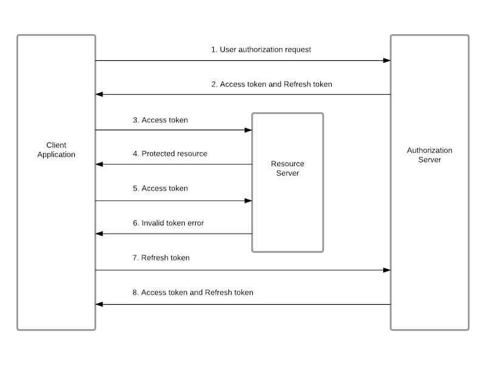

# Authentication concepts

This page provides some key concepts of authentication implementation introducing the actual implementation in next pages.

## State

The choice between stateless and stateful architectures depends on the specific requirements and characteristics of the application or system you are designing.

### Stateless Architecture

In a stateless architecture, each request from a client to a server is treated as new; there is no stored knowledge of previous interactions. This approach simplifies the design and increases scalability since each request can be processed independently.

**When to Use Stateless:**

1. **Scalability:** Stateless applications can be easily scaled horizontally as each request is independent.
2. **Simplicity:** Easier to understand and manage due to the lack of dependency between requests.
3. **Load Balancing:** Works well with load balancing as any request can be sent to any server.
4. **Stateless Protocols:** Ideal for RESTful services where each HTTP request contains all the information needed to process it.
5. **Short-Lived Operations:** Suitable for operations that do not require knowledge of previous interactions.

### Stateful Architecture

In a stateful architecture, the server retains information about the state of each client across multiple requests. This can allow for more complex interactions and personalization.

**When to Use Stateful:**

1. **Complex Transactions:** Useful for operations where subsequent requests depend on the results of previous ones.
2. **Real-Time Applications:** Ideal for applications requiring real-time data sync like chat applications or online gaming.
3. **Personalization:** When the user experience benefits from remembering previous interactions (e.g., shopping carts, user preferences).
4. **Resource Management:** Essential for applications that manage resources that need to be tracked across multiple requests (e.g., sessions in a web application).
5. **Long-Running Processes:** Suitable for workflows where operations are conducted in multiple stages over time.

### Hybrid Approach

Sometimes, a hybrid approach is used, where parts of the application are stateless and others are stateful. This can be beneficial for balancing scalability with the need for complex interactions.

## Token based authentication

Token-based authentication is a popular method used in modern web applications for verifying the identity of users and facilitating secure access to resources. It typically involves access tokens and refresh tokens. Here is an overview of how it works:

### 1. User Authentication

- **Initial Login:** The process begins when a user logs in with their credentials (like a username and password).
- **Verification:** The server verifies these credentials against its database.
- **Token Generation:** If the credentials are valid, the server generates an access token and, often, a refresh token.

### 2. Access Token

- **Purpose:** The access token is a compact, digital key that allows access to the application's resources.
- **Content:** It typically contains encoded data (like user ID, permissions, and expiration time) and is often created using a standard like JSON Web Tokens (JWT).
- **Usage:** The user’s client (like a web browser) includes this token in the HTTP header of subsequent requests to the server.
- **Security:** The server validates this token using either a secret key or a public/private key pair.
- **Expiration:** Access tokens are short-lived, expiring after a set period (like an hour) to reduce security risks.

### 3. Refresh Token

- **Purpose:** A refresh token is used to obtain a new access token when the current access token is about to expire or has expired.
- **Longevity:** Refresh tokens are usually longer-lived than access tokens.
- **Security:** They are stored securely on the client and sent to the server to request new access tokens.
- **Process:** When an access token expires, the client sends the refresh token to a specific endpoint on the server to get a new access token.
- **Revocation:** The server can revoke refresh tokens in case of a security breach or when the user logs out.

### 4. Continuous Access

- **Seamless Experience:** This system allows users to remain authenticated and continue accessing resources without needing to log in again each time the access token expires.
- **Security Checks:** The server can implement additional security checks when a refresh token is used to issue a new access token, like validating the originating IP address or user agent.

## JWT tokens

[JWT](https://jwt.io/), which stands for JSON Web Token, is a compact, URL-safe means of representing claims to be transferred between two parties. The claims in a JWT are encoded as a JSON object that is digitally signed using JSON Web Signature (JWS) and/or encrypted using JSON Web Encryption (JWE).

### Structure of JWT

A JWT typically consists of three parts separated by dots (`.`), which are:

1. **Header:** The header typically consists of two parts: the type of the token, which is JWT, and the signing algorithm being used, such as HMAC SHA256 or RSA.

   Example: `{"alg": "HS256", "typ": "JWT"}`

2. **Payload:** The payload contains the claims. Claims are statements about an entity (typically, the user) and additional metadata. There are three types of claims: registered, public, and private claims.

   Example: `{"sub": "1234567890", "name": "John Doe", "admin": true}`

3. **Signature:** To create the signature part, you have to take the encoded header, the encoded payload, a secret, the algorithm specified in the header, and sign that.

   Example: `HMACSHA256(base64UrlEncode(header) + "." + base64UrlEncode(payload), secret)`

### Usage of JWT

- **Authentication:** After the user is logged in, each subsequent request will include the JWT, allowing the user to access routes, services, and resources permitted with that token.
- **Information Exchange:** JWTs are a good way of securely transmitting information between parties because they can be signed, which means you can be sure that the senders are who they say they are.

### Advantages of JWT

1. **Compact:** Can be sent through URL, POST parameters, or HTTP headers.
2. **Self-contained:** The payload contains all the required information about the user, avoiding the need to query the database more than once.
3. **Decoupled Authentication:** Enables decoupling of the token generation and validation processes, allowing for more scalable and modular design.

### Security Considerations

- Always use HTTPS to protect JWTs in transit.
- Be cautious with the payload content to avoid exposing sensitive information, as the base64 encoding of the header and payload is not encrypted, just encoded.
- Implement proper token expiration and management strategies.
- Secure the token's secret key or private key used for signing to prevent unauthorized access.

## Where to store tokens?

In Single Page Applications (SPAs), securely storing access and refresh tokens is crucial to maintain application security. The common storage options include:

### 1. **Local Storage**

- **Usage:** Many SPAs store tokens in the browser's local storage due to its simplicity and ease of access.
- **Pros:** Easy to implement and use; persists across browser sessions.
- **Cons:** Vulnerable to Cross-Site Scripting (XSS) attacks. If an attacker can execute JavaScript on the client's page, they can access local storage and steal the tokens.

### 2. **Session Storage**

- **Usage:** Similar to local storage but limited to a single session or tab.
- **Pros:** Data is cleared when the tab or window is closed, reducing the risk of long-term token compromise.
- **Cons:** Still vulnerable to XSS attacks and doesn't persist across sessions.

### 3. **Cookies**

- **Usage:** Storing tokens in cookies can mitigate some risks associated with local or session storage.
- **Pros:**
  - Less vulnerable to XSS attacks as cookies can be marked as `HttpOnly`, making them inaccessible to JavaScript.
  - Can be configured as `Secure` to ensure they are sent over HTTPS.
  - Can leverage the `SameSite` attribute to prevent Cross-Site Request Forgery (CSRF) attacks.
- **Cons:**
  - If not properly configured, cookies can be vulnerable to CSRF attacks.
  - The application might require extra handling to manage cookies, especially in cross-domain scenarios.

### 4. **In-Memory**

- **Usage:** Storing the tokens in JavaScript variables or React state (in case of a React SPA).
- **Pros:**
  - Immune to XSS attacks as the data is wiped out when the page session ends or is refreshed.
  - Provides a higher degree of control over token handling.
- **Cons:**
  - Tokens are lost when the page is refreshed or closed, which might not be ideal for user experience.
  - Requires more complex handling for persisting authentication state across sessions.

### 5. **Refresh Token Rotation**

- **Usage:** Implementing a refresh token rotation policy where a new refresh token is issued with each access token refresh request.
- **Pros:** Limits the lifespan of a stolen refresh token.
- **Cons:** Adds complexity to the token management on both client and server sides.

## OdbVue

- uses **stateless** architecture

- uses **JWT tokens** for authentication

- stores a **refresh token** in a _httpOnly_ cookie with long 1d+ expiration date and an **access token** with 15m expiration date directly in memory
