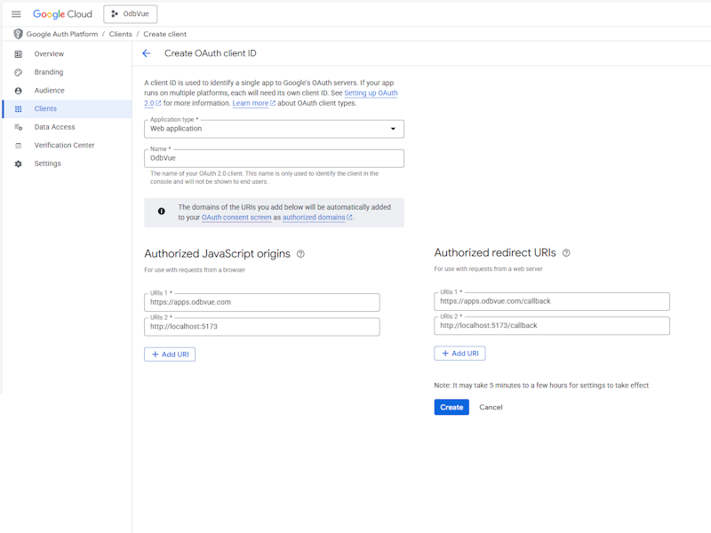

# Social sign up

## Setup

Create Google OAuth 2.0 Client IDs

Create [Google credentials](https://console.cloud.google.com/apis/credentials)



Add uri `https://apps.odbvue.com` and callback `https://apps.odbvue.com/callback` as well as for local development `http://localhost:5173` and callback `http://localhost:5173/callback`.

## Dependencies

Vue3 login plugin

```bash
pnpm install vue3-google-login
```

Add key to environment variables `.env.production` and `.env.development.local`

```ini
VITE_GOOGLE_CLIENT_ID = ********-********.apps.googleusercontent.com
```

## Views

### Login

#### `@/pages/login.vue`

::: details source
```vue
<template>
  <v-container>
    <v-row>
      <v-col>
  <!-- // -->
        <br />
        <br />
        <GoogleLogin :clientId="googleClientId" :callback="callback" />
      </v-col>
    </v-row>
  </v-container>
</template>

<script setup lang="ts">
// ...
import { GoogleLogin } from 'vue3-google-login'
import { decodeCredential, type CallbackTypes } from 'vue3-google-login'
const googleClientId = import.meta.env.VITE_GOOGLE_CLIENT_ID

const callback = async (response: CallbackTypes.CredentialPopupResponse) => {
  const userData = decodeCredential(response.credential) as {
    email: string
    sub: string
    name: string
  }
  if (await app.auth.login(userData.email, `GoogleOAuth2.0${userData.sub}`))
    router.push((route.query.redirect as string) || '/')
}
// ...
</script>

```
:::

### Sign-up

#### `@/pages/signup.vue`

::: details source
```vue
<template>
  <v-container>
    <v-row>
      <v-col>
  <!-- // -->
        <br />
        <br />
        <GoogleLogin :clientId="googleClientId" :callback="callback" />
      </v-col>
    </v-row>
  </v-container>
</template>

<script setup lang="ts">
// ...
import { GoogleLogin } from 'vue3-google-login'
import { decodeCredential, type CallbackTypes } from 'vue3-google-login'
const googleClientId = import.meta.env.VITE_GOOGLE_CLIENT_ID

const callback = async (response: CallbackTypes.CredentialPopupResponse) => {
  const consentId = await askConsent()
  if (!consentId) {
    return
  }
  const userData = decodeCredential(response.credential) as {
    email: string
    sub: string
    name: string
  }
  const signupResponse = await app.auth.signup(
    userData.email,
    `GoogleOAuth2.0${userData.sub}`,
    userData.name,
    consentId,
  )
  options.value.errors = signupResponse?.errors || []
  if (!signupResponse?.error && !signupResponse?.errors) {
    router.push((route.query.redirect as string) || '/')
  }
}
</script>
```
:::
