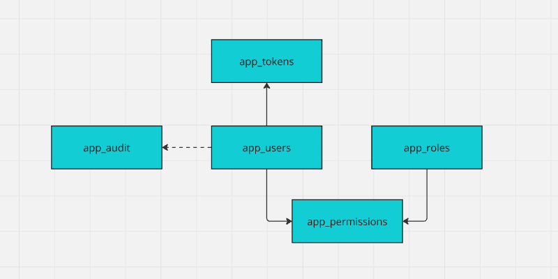

# Authorization

## Concepts

### Role-Based Authorization

A security mechanism that restricts access to resources or functionality based on a user's role within an application. It ensures users can only perform actions or view content permitted for their assigned roles.

### Navigation Guards

A feature in front-end frameworks that controls access to routes or pages based on conditions such as authentication, user roles, or application state, ensuring users navigate only to authorized or appropriate areas.

### Page Meta

Metadata associated with a web page, such as titles, descriptions, and keywords, used to improve SEO, accessibility, and user experience. Page meta's are often set dynamically based on the content or purpose of the page.

## Data model



## API

Extend existing `get_context` routine to return privilege data.

#### `./db/src/database/odbvue/package_bodies/pck_app.sql`

```plsql{7-24}
-- ...
  OPEN r_user FOR SELECT
      uuid           AS "uuid",
      username       AS "username",
      fullname       AS "fullname",
      created        AS "created",
      coalesce((
          SELECT
              JSON_ARRAYAGG(
                  JSON_OBJECT(
                      'role' VALUE r.role,
                      'permission' VALUE p.permission,
                      'validfrom' VALUE p.valid_from,
                      'validto' VALUE p.valid_to
                  )
              )
          FROM
                    app_permissions p
              JOIN app_roles r ON r.id = p.id_role
              JOIN app_users u ON u.id = p.id_user
          WHERE
              u.uuid = v_uuid
      ),
                '[]') AS "{}privileges"
  FROM
      app_users
  WHERE
  uuid = v_uuid
  AND v_uuid IS NOT NULL;
-- ...
```

## Store

User data type with privileges in Application Main store.

#### `@/stores/index.ts`

```ts
    // ..
    type ContextResponse = {
      version: string
      user?: {
        uuid: string
        username: string
        fullname: string
        created: string
        privileges: {
          role: string
          permission: string
          validfrom: string
          validto: string
        }[]
      }[]
      consents: {
        id: string
        language: string
        name: string
        created: string
      }[]
    }
    // ..    

    const defaultUser = {
      uuid: '',
      username: '',
      fullname: '',
      created: '',
      privileges: [] as {
        role: string
        permission: string
        validfrom: string
        validto: string
      }[],
    }
    // ..
```

## Pages & Page Meta's

### Overview of page access `meta.role`

| Role       | Description                                                                                 |
| ---------- | ------------------------------------------------------------------------------------------- |
| public     | Page is always visible and accessible without authentication                                |
| guest      | Page is visible and accessible only for **un**-authenticated users (e.g. `/login`, `/signup`)                          |
| restricted | Page is visible to users without authentication but accessible only for authenticated users. Un-authenticated users get message `unauthorized` |
| **`x`**    | Page is visible and accessible only for authenticated users **with role `X`** (e.g. `/admin`)              |

Page meta can be set either as

```vue
<route lang="json">
{
  "meta": {
    "role": "public"
  }
}
</route>
```

or (preferred)

```ts
<script setup lang="ts">
definePage({ meta: { role: 'guest' } })
// ...
</script>
```

or (for .md files) as

```md{5}
---
title: About BSB
description: Learn more about our platform and its capabilities
icon: $mdiInformation
role: public
color: primary
---

# This is an MD file
```

### Apply meta to pages

**public**

- `@/pages/index.vue`
- `@/pages/about.md`
- `@/pages/[...path].vue`

**guest**

- `@/pages/login.vue`
- `@/pages/signup.vue`
- `@/pages/recover-password.vue`
- `@/pages/reset-password/[token].vue`

**restricted**

- `@/pages/sandbox/**`
- `@/pages/confirm-email/[id].vue`

**Aadmin**

- create a new page `@/pages/admin/index.vue`

```vue
<template>
  <h1>Admin</h1>
  <p>Nothing here yet</p>
</template>
<route lang="json">
{
  "meta": {
    "title": "Admin",
    "role": "admin"
  }
}
</route>
```

## Navigation guards

Guard method in Navigation Store

#### `@/stores/app/navigation.ts`

::: details source
<<< ../../../src/stores/app/navigation.ts
:::

Guard in Router 

#### `@/router/index.ts`

```ts
// ...
router.beforeEach(async (to) => {
  const app = useAppStore()
  app.ui.clearMessages()
  const result: string | boolean = app.navigation.guard(to.path)
  if (result) {
    const appTitle = title || 'OdbVue'
    const pageTitle = app.navigation.title(to.path)
    const documentTitle = pageTitle ? `${appTitle} - ${pageTitle}` : appTitle
    useHead({ title: documentTitle })
  } else {
    window.scrollTo(0, 0)
    app.ui.setError('unauthorized')
  }
  return result === '/login' ? { path: result, query: { redirect: to.path } } : result
})
// ...
```

> [!WARNING]
> Client side navigation guard does not prevent from authorization flaws, always apply navigation guards in back-end using `pck_api_auth.role` and `pck_api_auth.perm`!
