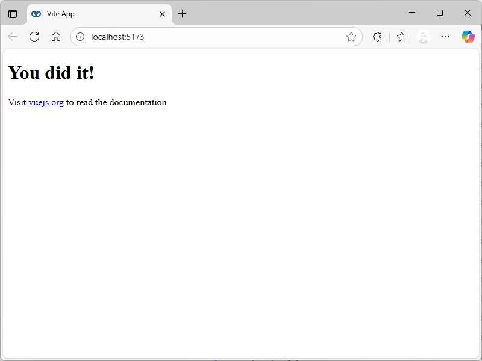

# Setting up VueJs

## Create the new app

[VueJs](https://vuejs.org/) comes with prebuilt tooling making creation of the new app smooth and saving a lot of time.

1. From the root directory of the project, run:

```bash
pnpm create vue@latest
```

and follow the wizard. Here are the recommended selections:

```
┌  Vue.js - The Progressive JavaScript Framework
│
◇  Project name (target directory):
│  apps
│
◇  Select features to include in your       
project: (↑/↓ to navigate, space to select, 
a to toggle all, enter to confirm)
│  TypeScript, Router (SPA development),    
Pinia (state management), Vitest (unit      
testing), End-to-End Testing, ESLint (error 
prevention), Prettier (code formatting)     
│
◇  Select an End-to-End testing framework:  
(↑/↓ to navigate, enter to confirm)
│  Playwright
│
◇  Select experimental features to include  
in your project: (↑/↓ to navigate, space to 
select, a to toggle all, enter to confirm)  
│  rolldown-vite (experimental)
│
◇  Skip all example code and start with a   
blank Vue project?
│  Yes

```

2. Run the project

```bash
cd apps
pnpm install
pnpm format
pnpm dev
```

3. You will now be able to open your application in a browser. Follow instructions in a terminal.



## What is included?

As mentioned, Vue.js comes with a number of selections, many of which will be improved and extended in the app. Here is a brief summary.

### TypeScript

[TypeScript](https://www.typescriptlang.org/) is a strongly typed programming language that builds on JavaScript, giving you better tooling at any scale.

### Vue Router

[Vue Router](https://router.vuejs.org/) provides expressive, configurable and convenient routing capabilities for the application.

### Pinia

[Pinia](https://pinia.vuejs.org/) provides state management for Vue.js enabling the creation of large and complex applications.

### Vitest

[Vitest](https://vitest.dev/) is a test framework for writing unit tests and component tests.

### Playwright

[Playwright](https://playwright.dev/) is a an end-to-end test framework for modern web apps. It bundles test runner, assertions, isolation, parallelization and rich tooling and supports variety of browsers.

### ESLint

[ESLint](https://eslint.org/) is a static code analyzer that identifies potential problems in code.

### Prettier

[Prettier](https://prettier.io/) is a code formatter that ensures that code is consistently written throughout the project.

### File path alias

In addition, the app is pre-configured with a file path alias for files in `./src` to avoid writing constructions like `../../include`. Instead, we can use a file path alias for the source directory and write `@/components/include`, where `@` represents the `./src` directory.

> [!NOTE]
> In coming months major upgrades are expected to boost performance and developer experience by upgrading tooling to Rust and introducing Alien Signals and Vapor mode. At the same time no changes in APIs are expected.