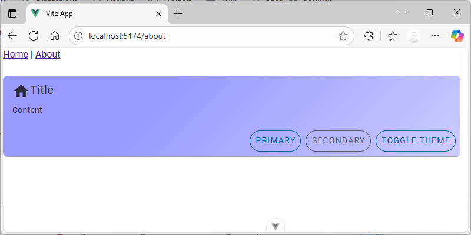

# UI Component Framework

## Why Vuetify?

There are number of UI frameworks for Vue out there. Check this [comparison](https://blog.logrocket.com/best-ui-frameworks-vue-3/). [Vuetify](https://vuetifyjs.com/) is often considered one of the best UI component frameworks for Vue.js due to **Material design**, **Rich Component Library** and by design **Responsive Design**.

## Add Vuetify to the project

1. Install [Vuetify](https://vuetifyjs.com/) Component Framework

```ps
pnpm install vuetify
pnpm install -D vite-plugin-vuetify
```

2.  Add Vuetify Plugin to Vite configuration `/vite.config.ts` to enable Hot Module Reloading for Vuetify components.

```ts
// ...
import Vuetify from 'vite-plugin-vuetify'

export default defineConfig({
  plugins: [
    // ...
    Vuetify(),
  ],
  // ...
})
```

3. Create new file `@/plugins/vuetify.ts` with Vuetify configuration.

```ts
import 'vuetify/styles'
import { createVuetify } from 'vuetify'

export default createVuetify({})
```

4. Modify `@/main.ts` to use Vuetify

```ts{2,7}
// ...
import vuetify from './plugins/vuetify'

const app = createApp(App)

// ...
app.use(vuetify)

app.mount('#app')
```

5. Create new test page `@/pages/sandbox/index.vue` and open `http://localhost:5173/sandbox` to see Vuetify UI Components in action.

```vue
<template>
  <v-card>
    <v-card-title>Title</v-card-title>
    <v-card-text>Content</v-card-text>
    <v-card-actions>
      <v-btn @click="console.log('Primary!')" color="primary">Primary</v-btn>
      <v-btn @click="console.log('Secondary!')" color="secondary">Secondary</v-btn>
    </v-card-actions>
  </v-card>
</template>
```

## Blueprints

[Blueprints](https://vuetifyjs.com/en/features/blueprints/) is a collection of pre-defined Material design defaults. Choose the blueprint and add in `@/plugins/vuetify.ts`

```ts
// ...
import { md3 } from 'vuetify/blueprints'
// ...
export default createVuetify({
  // ...
  blueprint: md3,
})
```

## Themes

[Theme](https://vuetifyjs.com/en/features/theme/) allows to create different themes for your application.

1. Create light and dark themes.

::: details `@/themes/themes.json`
<<< ../../../src/themes/themes.json
:::

2. Import and add customized color schemes for light and dark themes in `@/plugins/vuetify.ts`.

```ts{2,6-12}
// ...
import { light, dark } from '@/themes/themes.json'
// ...
export default createVuetify({
// ...
  theme: {
    defaultTheme: 'system',
    themes: {
      light,
      dark,
    },
  },
//...
})
```

3. Add theme toggling to `@\pages\sandbox\index.vue` and check how it works.

```vue
<template>
  <v-card>
    <v-card-title>Title</v-card-title>
    <v-card-text>Content</v-card-text>
    <v-card-actions>
      <v-btn @click="console.log('Primary!')" color="primary">Primary</v-btn>
      <v-btn @click="console.log('Secondary!')" color="secondary">Secondary</v-btn>
      <v-btn @click="theme.toggle()">Toggle theme</v-btn>
    </v-card-actions>
  </v-card>
</template>

<script setup lang="ts">
import { useTheme } from 'vuetify'
const theme = useTheme()
</script>
```

## Global configuration

[Global configuration](https://vuetifyjs.com/en/features/global-configuration/) is one of the most powerful features allowing you to set default prop values globally or per component when setting up your application. As an example, to make all card action buttons outlined globally:

1. Create file `@/themes/defaults.ts`

As an example - to change globally how card action buttons are aligned:

```ts
export const defaults = {
  VCardActions: {
    VBtn: { variant: 'outlined' },
    class: 'd-flex flex-wrap justify-end gap-2',
  },
}

```

2. Import defaults in `@/plugins/vuetify.ts`

```ts
// ...
import defaults from '@/themes/defaults'
// ...
export default createVuetify({
  // ...
  defaults,
  // ...
})
```

## Icons

To keep bundled size low, it is important to include only icons that are used in the project.

1. Install icon library

```ps
pnpm install @mdi/js

```

2. Create file of used icons `@/themes/icons.ts`

```ts
import { mdiHome } from '@mdi/js'
export default { mdiHome }
```

3. Imports icons into `@/plugins/vuetify.ts`

```ts
// ...
import { aliases, mdi } from 'vuetify/iconsets/mdi-svg'
import icons from '@/themes/icons'
// ...
export default createVuetify({
  //...
  icons: {
    defaultSet: 'mdi',
    aliases: {
      ...aliases,
      ...icons,
    },
    sets: {
      mdi,
    },
  },
  //...
})
```

4. Add icon to `@/pages/sandbox/index.vue`

```vue
...
<v-card-title><v-icon icon="$mdiHome" />Title</v-card-title>
...
```

## Custom Styling

Likely not needed at all, but still an option in some rare cases. 

1. Create `@/themes/index.css`

```css
div.markdown-body h1 {
  margin-bottom: 24px;
}

div.markdown-body h2 {
  margin-top: 8px;
  margin-bottom: 16px;
}

div.markdown-body h3 {
  margin-top: 8px;
  margin-bottom: 12px;
}

div.markdown-body ul {
  margin-bottom: 8px;
}

div.markdown-body li {
  margin-left: 24px;
}

div.markdown-body p {
  margin-bottom: 8px;
}

div.markdown-body hr {
  margin-top: 8px;
  margin-bottom: 8px;
}
```

2. Import in `@/main.ts`

```ts
import './themes/index.css'
//
```

## Cherries

It is always nice to add some small nuance that differentiates your app from others. Here is an example to provide customized background style.

1. Create a new composable `@\composables\ui.ts` for enhanced UI features

```ts
import { computed } from 'vue'
import { useTheme } from 'vuetify'

export function useCardBackground(color: string) {
  const theme = useTheme()

  return computed(() => {
    const dark = theme.current.value.dark
    const grFrom = dark ? '33' : '66'
    const grTo = dark ? '66' : '33'

    return {
      background: `linear-gradient(135deg, ${color}${grFrom} 33%, ${color}${grTo} 100%)`
    }
  })
}

```

2. Add custom card background to `@/pages/sandbox.vue`

```vue{2,15,18}
<template>
  <v-card :style="cardBackground">
    <v-card-title><v-icon icon="$mdiHome" />Title</v-card-title>
    <v-card-text>Content</v-card-text>
    <v-card-actions>
      <v-btn @click="console.log('Primary!')" color="primary">Primary</v-btn>
      <v-btn @click="console.log('Secondary!')" color="secondary">Secondary</v-btn>
      <v-btn @click="theme.toggle()">Toggle theme</v-btn>
    </v-card-actions>
  </v-card>
</template>

<script setup lang="ts">
import { useTheme } from 'vuetify'
import { useCardBackground } from '@/composables/ui'

const theme = useTheme()
const cardBackground = useCardBackground('#0000ff')
</script>
```

This function will provide possibility to dynamically adjust object backgrounds.




