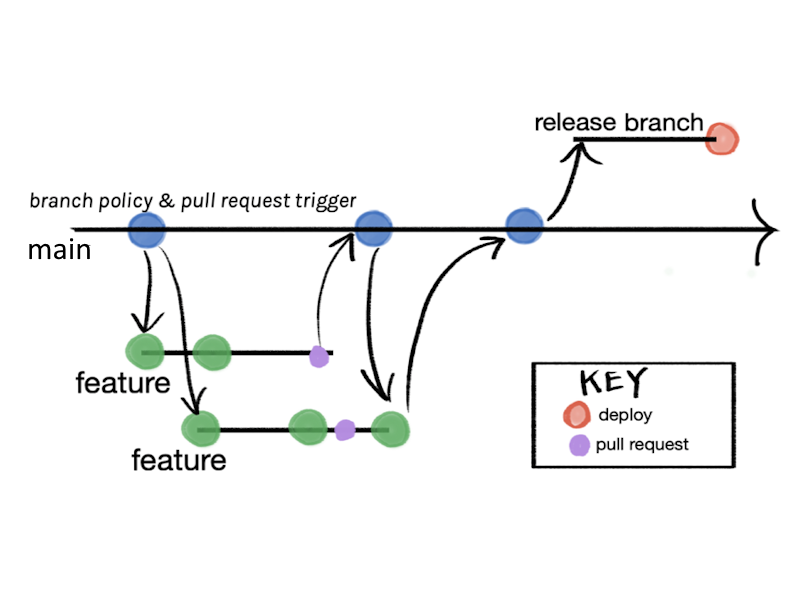

# Branching strategies

## Overview

Branching strategies define how teams organize, isolate, and integrate their work within a Git repository. They provide a structured way to manage parallel development, control releases, and maintain stability in production while allowing continuous progress on new features or fixes. 

The main benefit of using a clear branching strategy is that it helps teams collaborate efficiently, reduce merge conflicts, and ensure predictable, high-quality releases. 

By choosing the right model - whether lightweight for speed or structured for control - teams can balance agility with stability, adapt to their release cadence, and keep their codebase healthy as the project grows.

## Common strategies

**Trunk-Based Development**
Everyone works on short-lived branches from `main`, merging small, frequent changes behind feature flags. The `main` branch is always deployable. It’s ideal for small, fast-moving teams that have good CI/CD and testing discipline.

**Trunk + Temporary Release Branch**
This is mostly trunk-based, but when you need a stabilization period, you create a temporary `release/x.y.z` branch. The release branch is used for QA and bug fixes, then merged back and deleted after deployment. It’s a lightweight way to handle irregular or planned releases.

**Lightweight GitFlow**
You keep two main long-lived branches: `main` for production and `develop` for integration. Feature branches start from `develop`, and releases are cut and merged into both `main` and `develop` once ready. It adds a bit of structure without the full complexity of traditional GitFlow.

**Environment Branching**
Different long-lived branches (`dev`, `staging`, `prod`) represent your deployment environments. Code moves between them through merges as it passes tests or approvals. This works well if your deployment pipeline is tied to branch names, but it can lead to divergence if not managed carefully.

**Release Branch per Supported Version**
Each supported version of your product lives in its own branch (`release/1.8`, `release/1.9`, etc.). New development continues on `main`, and bug fixes are backported as needed. It’s useful for maintaining multiple live versions but adds backporting overhead.

**Feature Branch Workflow**
Every new feature or task is developed in its own branch, usually off `main` or `develop`. Once complete and tested, it’s merged back through a pull request. This keeps work isolated and clean, making it easy to track and review changes.

**GitFlow**
A structured model with multiple branch types: `main`, `develop`, `feature/*`, `release/*`, and `hotfix/*`. Designed for regular, versioned releases and larger teams with formal QA processes. It offers strong control but can be heavy for small or fast-paced teams.

## Selection matrix

| Strategy                                       | How it works                                                                                         | Complexity                                             | Team size fit                   | Release cadence fit              | Use when…                                                            | Watch-outs                                                                   |
| ---------------------------------------------- | ---------------------------------------------------------------------------------------------------- | ------------------------------------------------------ | ------------------------------- | -------------------------------- | -------------------------------------------------------------------- | ---------------------------------------------------------------------------- |
| **Trunk-Based (short-lived feature branches)** | Everyone branches from `main`, merges small PRs quickly (behind flags). Hotfixes from tag.           | **Low**                                                | 1–15 devs                       | Any; best for frequent/irregular | You want speed, minimal ceremony, one live version.                  | Requires strong CI, flags, and code review discipline.                       |
| **Trunk + Temporary Release Branch**           | Same as trunk; when stabilizing, cut `release/x.y.z` for a short hardening window.                   | **Low→Medium**                                         | 3–20                            | Irregular or date-driven         | You occasionally need a QA freeze or marketing date.                 | Cherry-picks needed if `main` keeps moving. Keep release branch short-lived. |
| **Lightweight GitFlow**                        | `main` (prod), `develop` (integration), short-lived `feature/*`, occasional `release/*`, `hotfix/*`. | **Medium**                                             | 8–40                            | Regular batched releases         | You want a standing integration branch (`develop`) to buffer `main`. | Extra merges + drift. Easy to overcomplicate.                                |
| **Environment Branching**                      | Long-lived `dev` → `staging` → `prod`; promote by merges.                                            | **Medium**                                             | 5–30                            | Scheduled                        | Your infra/tooling is tied to branches per env.                      | Risk of divergence; promotion merges can be noisy.                           |
| **Release Branch per Supported Version**       | Keep `release/1.8`, `release/1.9` alive for maintenance while building `1.10` on `main`.             | **High**                                               | 10–50                           | Slow, multi-version support      | You must patch old versions customers are on.                        | Backport overhead, complex support matrix.                                   |

## Recommended OdbVue strategy

**Trunk + Temporary Release Branch**

### Tagging policy (explicit)

> [!IMPORTANT]
> By default, release tags (vX.Y.Z) are created from the `main` branch. Only create a short‑lived `release/x.y.z` branch when you need a stabilization/hardening window (e.g., coordinated QA or a date‑driven cut). In that case, complete QA on the temporary release branch, tag from that branch, then merge back and delete the release branch.

