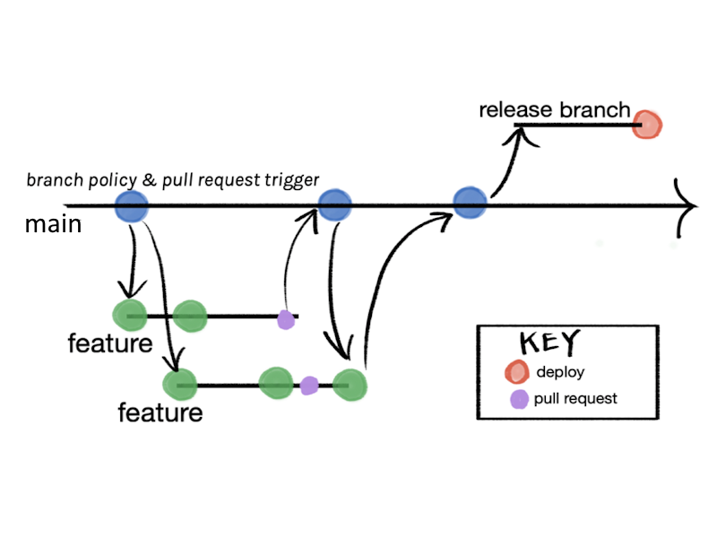

# Branching strategies

## Overview

Branching strategies define how teams organize, isolate, and integrate their work within a Git repository. They provide a structured way to manage parallel development, control releases, and maintain stability in production while allowing continuous progress on new features or fixes. 

The main benefit of using a clear branching strategy is that it helps teams collaborate efficiently, reduce merge conflicts, and ensure predictable, high-quality releases. 

By choosing the right model—whether lightweight for speed or structured for control—teams can balance agility with stability, adapt to their release cadence, and keep their codebase healthy as the project grows.

## Common strategies

**Trunk-Based Development**
Everyone works on short-lived branches from `main`, merging small, frequent changes behind feature flags. The `main` branch is always deployable. It’s ideal for small, fast-moving teams that have good CI/CD and testing discipline.

**Trunk + Temporary Release Branch**
This is mostly trunk-based, but when you need a stabilization period, you create a temporary `release/x.y.z` branch. The release branch is used for QA and bug fixes, then merged back and deleted after deployment. It’s a lightweight way to handle irregular or planned releases.

**Lightweight GitFlow**
You keep two main long-lived branches: `main` for production and `develop` for integration. Feature branches start from `develop`, and releases are cut and merged into both `main` and `develop` once ready. It adds a bit of structure without the full complexity of traditional GitFlow.

**Environment Branching**
Different long-lived branches (`dev`, `staging`, `prod`) represent your deployment environments. Code moves between them through merges as it passes tests or approvals. This works well if your deployment pipeline is tied to branch names, but it can lead to divergence if not managed carefully.

**Release Branch per Supported Version**
Each supported version of your product lives in its own branch (`release/1.8`, `release/1.9`, etc.). New development continues on `main`, and bug fixes are backported as needed. It’s useful for maintaining multiple live versions but adds backporting overhead.

**Feature Branch Workflow**
Every new feature or task is developed in its own branch, usually off `main` or `develop`. Once complete and tested, it’s merged back through a pull request. This keeps work isolated and clean, making it easy to track and review changes.

**GitFlow**
A structured model with multiple branch types: `main`, `develop`, `feature/*`, `release/*`, and `hotfix/*`. Designed for regular, versioned releases and larger teams with formal QA processes. It offers strong control but can be heavy for small or fast-paced teams.

## Selection matrix

| Strategy                                       | How it works                                                                                         | Complexity                                             | Team size fit                   | Release cadence fit              | Use when…                                                            | Watch-outs                                                                   |
| ---------------------------------------------- | ---------------------------------------------------------------------------------------------------- | ------------------------------------------------------ | ------------------------------- | -------------------------------- | -------------------------------------------------------------------- | ---------------------------------------------------------------------------- |
| **Trunk-Based (short-lived feature branches)** | Everyone branches from `main`, merges small PRs quickly (behind flags). Hotfixes from tag.           | **Low**                                                | 1–15 devs                       | Any; best for frequent/irregular | You want speed, minimal ceremony, one live version.                  | Requires strong CI, flags, and code review discipline.                       |
| **Trunk + Temporary Release Branch**           | Same as trunk; when stabilizing, cut `release/x.y.z` for a short hardening window.                   | **Low→Medium**                                         | 3–20                            | Irregular or date-driven         | You occasionally need a QA freeze or marketing date.                 | Cherry-picks needed if `main` keeps moving. Keep release branch short-lived. |
| **Lightweight GitFlow**                        | `main` (prod), `develop` (integration), short-lived `feature/*`, occasional `release/*`, `hotfix/*`. | **Medium**                                             | 8–40                            | Regular batched releases         | You want a standing integration branch (`develop`) to buffer `main`. | Extra merges + drift. Easy to overcomplicate.                                |
| **Environment Branching**                      | Long-lived `dev` → `staging` → `prod`; promote by merges.                                            | **Medium**                                             | 5–30                            | Scheduled                        | Your infra/tooling is tied to branches per env.                      | Risk of divergence; promotion merges can be noisy.                           |
| **Release Branch per Supported Version**       | Keep `release/1.8`, `release/1.9` alive for maintenance while building `1.10` on `main`.             | **High**                                               | 10–50                           | Slow, multi-version support      | You must patch old versions customers are on.                        | Backport overhead, complex support matrix.                                   |

## Recommended OdbVue strategy

**Trunk + Temporary Release Branch**



### Initial setup

```bash
git checkout main
git fetch origin --tags
git pull
```

Keep `main` clean and deployable; protect it with CI checks and required reviews.

### Day-to-day development (feature branches)

```bash
# Create a new feature branch from main
git checkout -b feat/checkout-redesign main

# Work and commit regularly
git add .
git commit -m "feat(checkout): add address form"

# Stay up to date with main
git fetch origin
git rebase origin/main   # keep history linear

# Push and open PR early
git push -u origin feat/checkout-redesign
```

After code review and CI pass, **merge into `main` (squash)** → delete branch:

```bash
git checkout main
git fetch origin
git pull
git branch -d feat/checkout-redesign
git push origin --delete feat/checkout-redesign
```

### Start a release cycle (create temporary release branch)

When you want to stabilize a version for QA or a scheduled launch:

```bash
git checkout main
git pull
git checkout -b release/1.5.0
git push -u origin release/1.5.0
```

Now only **bug fixes, release notes, and version bumps** are allowed here.

### Apply fixes on the release branch

```bash
# Example: fixing a payment issue on the release branch
git checkout release/1.5.0
git checkout -b fix/payment-timeout

# Work, commit, and push
git add .
git commit -m "fix(payment): handle gateway timeout on retry"
git push -u origin fix/payment-timeout

# PR base: release/1.5.0 → merge after CI passes
```

If a fix also needs to go to `main`, cherry-pick it after merging:

```bash
git checkout main
git pull
git cherry-pick <commit_sha_from_release_fix>
git push
```

---

### Finalize and tag the release

Once QA signs off and the release is ready:

```bash
git checkout release/1.5.0
git pull

# Optional: bump version file (package.json, etc.)
git commit -am "chore(release): v1.5.0"
git push

# Create a tag to mark the exact release
git tag -a v1.5.0 -m "Release 1.5.0"
git push origin v1.5.0
```

### Merge release back to main and clean up

After deployment:

```bash
git checkout main
git pull
git merge --no-ff release/1.5.0
git push

# Delete release branch
git branch -d release/1.5.0
git push origin --delete release/1.5.0
```

### Hotfixes after release (tagged deploys)

If production (tag `v1.5.0`) needs an urgent patch:

```bash
git fetch --tags
git checkout -b hotfix/1.5.1 v1.5.0

# Fix the bug
git add .
git commit -m "fix: prevent null pointer on login callback"
git push -u origin hotfix/1.5.1

# Open PR into main, merge after CI
git checkout main
git pull
git tag -a v1.5.1 -m "Hotfix 1.5.1"
git push origin v1.5.1
```

If a newer release branch exists (e.g., `release/1.6.0`), cherry-pick the same fix:

```bash
git checkout release/1.6.0
git pull
git cherry-pick <hotfix_commit_sha>
git push
```

### Best Practices Summary

* **Branch naming:** `feat/*`, `fix/*`, `release/x.y.z`, `hotfix/*`
* **Merging:** squash PRs; no direct pushes to `main`
* **Tags:**

  * Always tag releases (`vX.Y.Z`) from the release branch
  * Always tag hotfixes (`vX.Y.Z+1`) after merging
* **Automation:** use GitHub Actions (or similar) to automatically publish changelogs and version bumps when a tag is pushed.
* **Cleanup:** delete feature/release branches after merge to keep the repo tidy.
