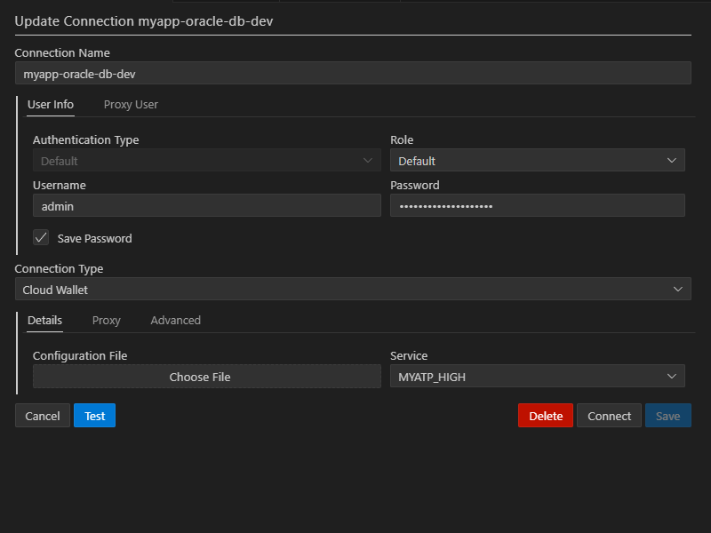

# Local database setup

## Prerequisites

- Docker or Podman installed (guide uses Podman, but Docker works the same)
- Recommended: 4+ CPU cores and 8GB RAM for smooth development

## Prepare environment

### Step 1. Create `.env` file

Create `.env` with passwords for Oracle Database:

```ini
ADMIN_PASSWORD="MySecurePass123#"
WALLET_PASSWORD="MySecurePass123#"
```

> [!WARNING]
> Always make sure that `.env` are gitignored

### Step 2. Create `Dockerfile`

Create `./Dockerfile` (with capital D):

<<<../../../../../i13e/local/db/Dockerfile

This pulls from [Oracle Container Registry](https://container-registry.oracle.com/ords/ocr/ba/database). As of mid 2025:
- `:latest` = Oracle 19c
- `:latest-23ai` = Oracle 23ai with built-in AI capabilities

### Step 3. Create `compose.yaml`

Create `./compose.yaml`:

<<<../../../../../i13e/local/db/compose.yaml

> [!NOTE]
> If running several databases locally, adjust different ports or use only one at the time

## Launch database

### Step 1. Run command to build and create container

```bash
podman compose up -d --build
```

### Step 2. Wait until installation finishes. It can take a while.

Progress can be monitored from command line. 

```bash
podman logs --tail 50 myapp-oracle-db-dev
```

If all is good, the Oracle Rest Data Services landing page will be up and running on `https://localhost:8443/ords`

## Connect to database

From VS Code using [Oracle SQL Developer Extension for VSCode](https://marketplace.visualstudio.com/items?itemName=Oracle.sql-developer)

### Step 1. Get the wallet file 

```bash
podman cp myapp-oracle-db-dev:/u01/app/oracle/wallets/tls_wallet ./tls_wallet
```

And zip all the contents into `./wallet.zip`

> [!WARNING]
> Make sure that `*.zip` are gitignored

### Step 2. Set up connection with Connection type as `Cloud Wallet` and choose created zip file.


