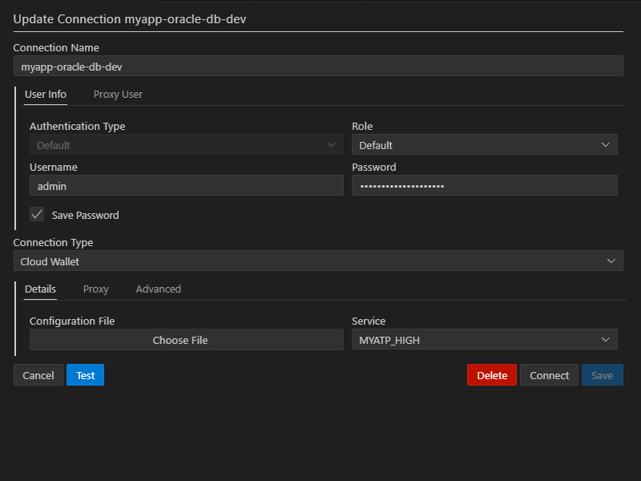

# Local database setup

## Prerequisites

Either Docker or Podman installed. Will use Podman, but it should work the same for Docker. For MS Windows it will require Setting up Windows Subsystem for Linux first.

And to have smooth developer experience - at least 4 CPU cores and 8Gb of RAM should be available.

## Launch Database

1. Create `./.env` file with passwords for Oracle Database.

```ini
ADMIN_PASSWORD=myStrongAdmPassword2025
WALLET_PASSWORD=myStrongWltPassword2025
```

2. Create `./Dockerfile` (with capital `D`)

```dockerfile
FROM container-registry.oracle.com/database/adb-free:latest-23ai
```

It will pull image from [Oracle Container Registry](https://container-registry.oracle.com/ords/ocr/ba/database). As of mid 2025, the `:latest` will get 19c while `:latest-23ai` will get all the goodies of out of the box AI capabilities in Oracle Database.

3. Create `./compose.yaml`

```yaml
services:
  oracle-db:
    build:
      context: .
    container_name: myapp-oracle-db-dev
    ports:
      - "1521:1521"
      - "1522:1522"
      - "8443:8443"
      - "27017:27017"
    environment:
      WORKLOAD_TYPE: ${WORKLOAD_TYPE:-ATP}
      ADMIN_PASSWORD: ${ADMIN_PASSWORD}
      WALLET_PASSWORD: ${WALLET_PASSWORD}
    cap_add:
      - SYS_ADMIN
    devices:
      - "/dev/fuse:/dev/fuse"
```

4. Run command to build and create container

```bash
podman compose up -d --build
```

5. Wait until installation finishes. It can take a while.

Progress can be monitored from command line. 

```bash
podman logs --tail 50 myapp-oracle-db-dev
```

If all is good, the Oracle Rest Data Services landing page will be up and running on `https://localhost:8443/ords`

## Connect to database

From VS Code using [Oracle SQL Developer Extension for VSCode](https://marketplace.visualstudio.com/items?itemName=Oracle.sql-developer)

1. Get the wallet file 

```bash
podman cp myapp-oracle-db-dev:/u01/app/oracle/wallets/tls_wallet ./wallets/myapp
```

And zip all the contents into `./wallets/myapp/wallet.zip`

2. Set up connection with Connection type as `Cloud Wallet` and choose created zip file.


