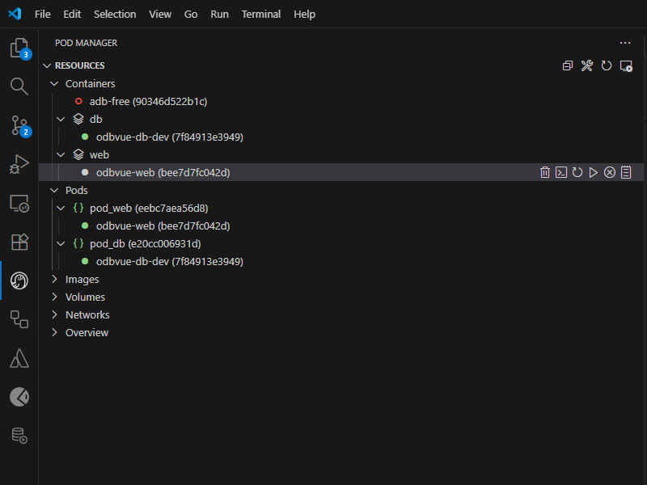

# Web Server for Local Development

Local web server environment using Podman and Nginx. Serves static site content with atomic deployments.

## Prerequisites

- **Podman** installed (Windows: WSL2 + Podman, Linux/Mac: Podman)

## Prepare environment

### Step 1. Create static initial `./html/index.html`

#### `./html/index.html`

::: details source
<<<../../../../../i13e/local/web/html/index.html
:::

### Step 2. Create Nginx configuration file

#### `./nginx.conf`

::: details source
<<<../../../../../i13e/local/web/nginx.conf {ini}
:::

### Step 3. Create Dockerfile

#### `./Dockerfile`

::: details source
<<<../../../../../i13e/local/web/Dockerfile
:::

### Step 4. Create Compose file

#### `./compose.yaml`

::: details source
<<<../../../../../i13e/local/web/compose.yaml
:::

> [!NOTE]
> You can adjust other port than 8080 if needed, or if running multiple web servers

### Step 5. Create Empty folder `./releases` and add it to Git ignore

#### `./.gitignore`

::: details source
<<<../../../../../i13e/local/web/.gitignore {ini}
:::

## Usage

### Scripts

#### `./build.sh`

::: details source
<<<../../../../../i13e/local/web/build.sh
:::

#### `./deploy.sh`

::: details source
<<<../../../../../i13e/local/web/deploy.sh
:::

#### `./remove.sh`

::: details source
<<<../../../../../i13e/local/web/remove.sh
:::

### Build & Run

Start container with web server:

```bash
./build.sh
```

This builds the Nginx container and starts it in the background. Web server runs on `http://localhost:8080`

### Deploy new content

Deploy website content to the running container:

```bash
./deploy.sh [container-name] [source-directory]
```

**Examples:**
```bash
./deploy.sh odbvue-web ./html
./deploy.sh odbvue-web ../../../apps/dist
```

**What Deploy Does**

1. Creates timestamped release directory: `releases/YYYY-MM-DD-HHMMSS/`
2. Copies files
3. Atomically switches `/releases/current` symlink to new release
4. Health checks the deployment
5. Keeps last 3 releases; cleans up old ones

### Stop and Remove

Remove container with web server:

```bash
./remove.sh [container-name]
```

## Accessing container

After successful setup from VSCode [Pod manager](https://marketplace.visualstudio.com/items?itemName=dreamcatcher45.podmanager) 



## Troubleshooting

**Check container status:**
```bash
podman ps
```

**View logs:**
```bash
podman logs [container-name]
```

**Test endpoint:**
```bash
curl http://localhost:8080
```
