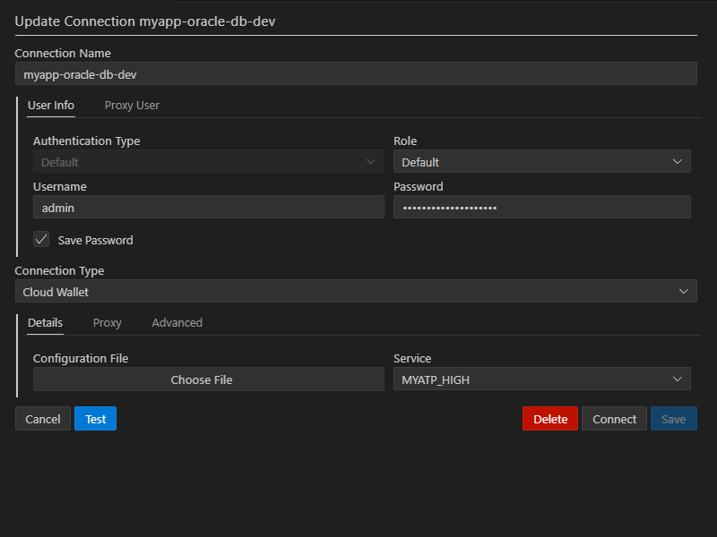

# Access to OCI Infrastructure

## OCI Console

[OCI Console](https://www.oracle.com/cloud/) - everything covered via web UI.

## Compute

```bash
ssh -i ~/.ssh/odbvue opc@[public-ip-address]
```

> [!WARNING]
> Possible only if port 22 is opened. Not recommended for production environments. 

## Autonomous Database

### VSCode

Set up connection with Connection type as `Cloud Wallet` using zip file loaded and saved by Terraform.



### SQLcl

[Download and install SQLcl for Local Development](https://www.oracle.com/database/sqldeveloper/technologies/sqlcl/download/)

Connect, using zip file loaded and saved by Terraform. 

```bash
sql -cloudconfig "[full path to wallet]/wallet.zip" admin/"MySecurePass123!"@odbvue_tp
```
> [!NOTE]
> If error than TNS_ADMIN is not set up:
> - Create a folder, preferably in home
> - Extract from wallet into that folder file `tnsnames.ora`
> - before connecting run: `set TNS_ADMIN="[full path to folder]"`
> - (for Windows): `$env:TNS_ADMIN = "[full path to folder]"` 
