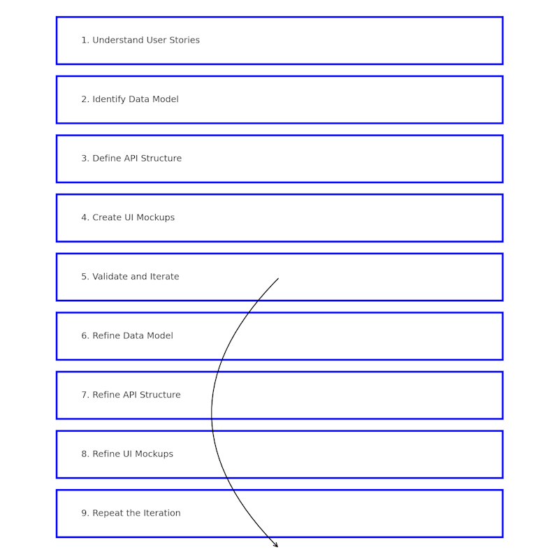

# Architecture and Design

## Architecture

OdbVue is a full-stack application template combining **Oracle Database** backend with a **Vue.js** frontend, designed for building enterprise-grade business applications.

### High-Level Overview

```
┌─────────────────────────────────────────────────────────────────┐
│                         Client Layer                            │
│  ┌─────────────┐  ┌─────────────┐  ┌─────────────────────────┐  │
│  │   Browser   │  │     PWA     │  │    Static Landing       │  │
│  │  (Vue SPA)  │  │   Support   │  │      (main/)            │  │
│  └─────────────┘  └─────────────┘  └─────────────────────────┘  │
└─────────────────────────────────────────────────────────────────┘
                              │
                              ▼
┌─────────────────────────────────────────────────────────────────┐
│                        API Layer (ORDS)                         │
│              Oracle REST Data Services - RESTful API            │
└─────────────────────────────────────────────────────────────────┘
                              │
                              ▼
┌─────────────────────────────────────────────────────────────────┐
│                      Database Layer                             │
│  ┌─────────────────────────────────────────────────────────┐    │
│  │              Oracle Database (AI-Native)                │    │
│  │  ┌─────────┐ ┌─────────┐ ┌─────────┐ ┌───────────────┐  │    │
│  │  │ Tables  │ │ PL/SQL  │ │  Jobs   │ │   AI/Vector   │  │    │
│  │  │         │ │ Packages│ │         │ │   Search      │  │    │
│  │  └─────────┘ └─────────┘ └─────────┘ └───────────────┘  │    │
│  └─────────────────────────────────────────────────────────┘    │
└─────────────────────────────────────────────────────────────────┘
```

### Repository Structure

| Folder | Purpose |
|--------|---------|
| `apps/` | Vue.js SPA application with Vuetify UI components |
| `db/` | Oracle Database schema, PL/SQL packages, and migrations |
| `cli/` | Command-line tools for development workflow |
| `main/` | Static landing page template |
| `i13e/` | Infrastructure configurations (local & OCI cloud) |

### Frontend Architecture (apps/)

Built with modern Vue 3 ecosystem:

- **Framework**: Vue 3 with Composition API
- **Build Tool**: Vite with HMR support
- **UI Library**: Vuetify 3 (Material Design)
- **State Management**: Pinia with persistent storage
- **Routing**: Vue Router with file-based routing
- **Internationalization**: Vue I18n (EN, DE, FR)
- **Testing**: Vitest (unit) + Playwright (E2E)
- **PWA**: Service worker support via vite-plugin-pwa

#### Key Directories

```
src/
├── components/     # Reusable UI components (VOv* prefix)
├── composables/    # Shared reactive logic (http, consent, ui)
├── layouts/        # Page layouts (Default, Fullscreen)
├── pages/          # File-based routing pages
├── stores/         # Pinia stores (auth, audit, settings, ui)
├── plugins/        # Vue plugins (vuetify, i18n, errors)
├── i18n/           # Translation files
└── themes/         # CSS theming
```

#### Custom Components

| Component | Description |
|-----------|-------------|
| `VOvChart` | Chart.js integration |
| `VOvDialog` | Modal dialogs |
| `VOvEditor` | TipTap rich text editor |
| `VOvForm` | Form handling |
| `VOvMap` | Google Maps integration |
| `VOvTable` | Data tables |

### Backend Architecture (db/)

Oracle Database with PL/SQL business logic exposed via ORDS:

#### Database Schema (odbvue)

**Core Tables:**
- `app_users`, `app_roles`, `app_permissions` - Authentication & authorization
- `app_tokens`, `app_token_types` - JWT token management
- `app_audit`, `app_audit_archive` - Audit logging
- `app_settings` - Configuration management
- `app_storage` - File/blob storage
- `app_emails`, `app_consents` - Communication & compliance

#### PL/SQL API Packages

| Package | Responsibility |
|---------|---------------|
| `pck_api_auth` | Authentication (login, tokens, refresh) |
| `pck_api_audit` | Activity logging |
| `pck_api_settings` | Application configuration |
| `pck_api_storage` | File management |
| `pck_api_emails` | Email notifications |
| `pck_api_openai` | AI/LLM integration |
| `pck_api_http` | External HTTP calls |
| `pck_api_json/xml/yaml` | Data format handling |
| `pck_api_pdf/zip` | Document processing |

### API Communication

The frontend communicates with Oracle via **ORDS REST endpoints**:

```
Frontend (Vue) ──HTTP/REST──▶ ORDS ──▶ PL/SQL Packages ──▶ Database
```

- JWT-based authentication with refresh tokens
- Centralized HTTP client in `composables/http.ts`
- Automatic token refresh handling
- Request queuing during token refresh

### Infrastructure (i13e/)

#### Local Development
- `local/db/` - Local Oracle Database setup
- `local/web/` - Local web server configuration

#### Oracle Cloud Infrastructure (OCI)
- `oci/basic/` - Basic OCI deployment
- `oci/k8s/` - Kubernetes deployment configuration

### CLI Tools (cli/)

Development workflow automation:

- `ov new-feature <name>` - Create feature branches
- Cross-platform support (PowerShell & Bash)
- Environment variable management
- Git workflow helpers

### Development Workflow

```
1. Feature Branch ──▶ 2. Develop ──▶ 3. Test ──▶ 4. PR ──▶ 5. Deploy
   (cli/ov nf)          (pnpm dev)    (vitest)    (main)    (i13e/)
```

### Security Considerations

- JWT access/refresh token pattern
- Role-based access control (RBAC)
- Audit logging for all operations
- User consent management (GDPR compliance)
- Secure password recovery flow

### Documentation (wiki/)

VitePress-powered documentation integrated within the apps folder, covering:
- Introduction & architecture
- Feature documentation
- Implementation guides

## Design

The iterative design process involves translating user stories into the data model, API, and UI mockups to create a well-designed and user-centric web application. Here's a breakdown of the process:

1. **Understand User Stories**: Begin by gathering user stories, which are descriptions of the features or functionality that users expect from the application. These stories capture the user's perspective and requirements. Work closely with stakeholders, conduct user research, and analyze user feedback to gain a deep understanding of the users' needs.

2. **Identify Data Model** Based on the user stories, identify the data elements and relationships required for the application. Design the data model or database schema that will store and organize the data. Consider the relationships between entities, data types, and any necessary constraints.

3. **Define API Structure**: Determine the API structure and endpoints that will be used to interact with the application's backend. Define the resources, methods (GET, POST, PUT, DELETE, etc.), and data formats (e.g., JSON) for each API endpoint. Consider the data flow between the front end and back end, and ensure that the API design aligns with the user stories.

4. **Create UI Mockups**: Develop UI mockups or wireframes that visually represent the application's user interface. These can be simple sketches or more detailed designs using design tools like Sketch, Figma, or Adobe XD. Focus on the layout, navigation, and key elements that will enable users to interact with the application effectively.

5. **Validate and Iterate**: Gather feedback on the data model, API design, and UI mockups. Collaborate with stakeholders, designers, and developers to review the designs against the user stories and requirements. Validate that the proposed solutions meet the users' needs and expectations. Iterate on the designs based on the feedback received.

6. **Refine Data Model** Based on the feedback and review process, refine the data model if needed. Make adjustments to the relationships, attributes, or constraints to align with the application's requirements and optimize data management.

7. **Refine API Structure**: Incorporate the feedback received during the review process and refine the API structure accordingly. Consider performance, scalability, and security aspects while making adjustments to the endpoints, request/response formats, and data validation.

8. **Refine UI Mockups**: Apply the feedback gathered from the design review to refine and improve the UI mockups. Ensure that the user interface is intuitive, visually appealing, and aligns with the application's requirements. Make necessary adjustments to the layout, typography, color scheme, and interactive elements.

9. **Repeat the Iteration**: Repeat steps 5 to 8, continually refining and iterating on the designs based on feedback until the data model, API, and UI mockups are well-aligned with the user stories and requirements. This iterative process ensures that the final designs effectively address the needs of the users.



By following this iterative design process, you can ensure that the data model, API, and UI mockups of your web application are continuously refined and improved, resulting in a well-designed and user-centric final product. Collaboration, feedback gathering, and iterative refinement are key elements in achieving a successful design outcome.
